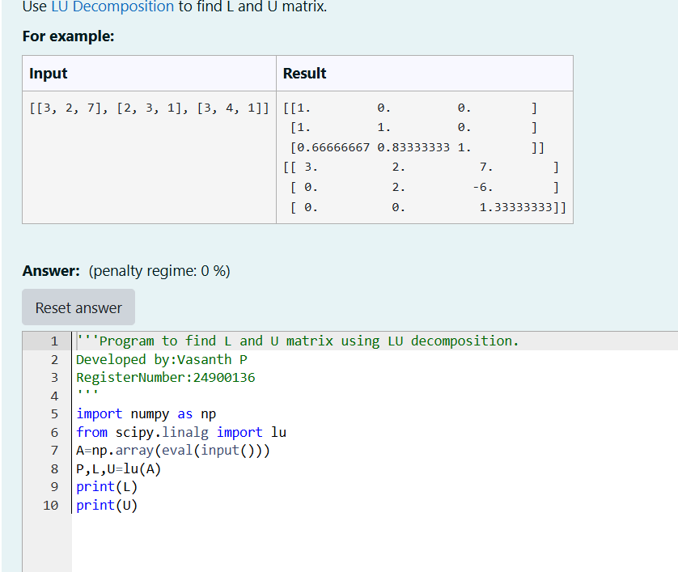
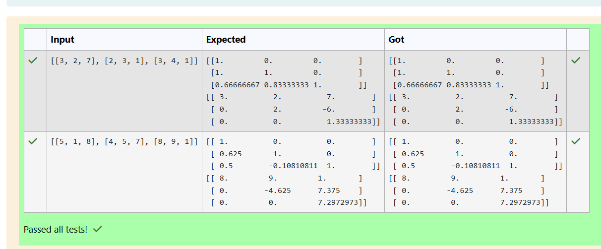
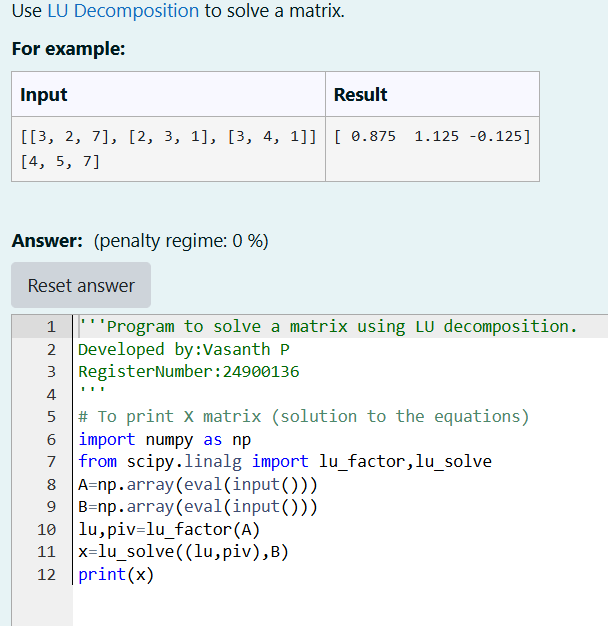
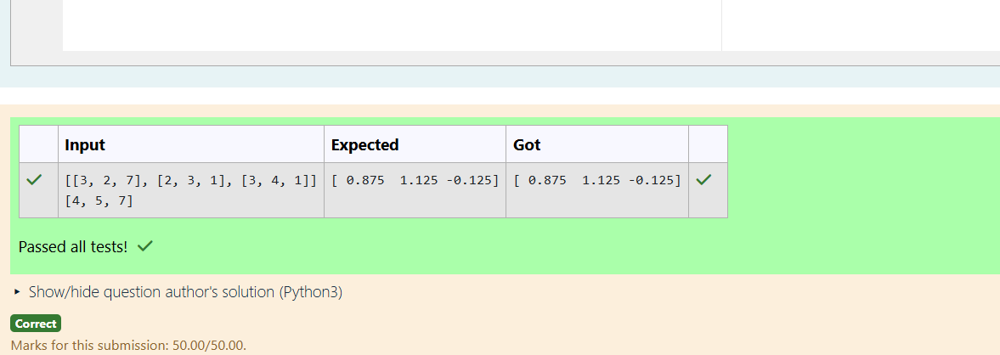

# LU Decomposition 

## AIM:
To write a program to find the LU Decomposition of a matrix.

## Equipments Required:
1. Hardware – PCs
2. Anaconda – Python 3.7 Installation / Moodle-Code Runner

## Algorithm
```
#Algorithm to find the L and U matrix.
1.Import the numpy module to use the built-in-functions for calculation 
2.From scipy.linalg import lu 
3.Enter the lists from each linear equation and assign in np.array()
4.Print L and U Matrix
5.End the program
## Algorithm for LU decomposition:
1.Import the numpy module to use the built-in-functions for calculation 
2.From scipy.linalg import lu 
3.Enter the lists from each linear equation and assign in np.array
4.Using lu_solve(), we can find L and U matrix
```

## Program:
(i) To find the L and U matrix
```
/*
Program to find the L and U matrix.
import numpy as np
from scipy.linalg import lu
A=np.array(eval(input()))
P,L,U=lu(A)
print(L)
print(U)

Developed by: Vasanth P
RegisterNumber: 24900136
*/
```
(ii) To find the LU Decomposition of a matrix
```
/*
Program to find the LU Decomposition of a matrix.
import numpy as np
from scipy.linalg import lu_factor,lu_solve
A=np.array(eval(input()))
B=np.array(eval(input()))
lu,piv=lu_factor(A)
x=lu_solve((lu,piv),B)
print(x)
Developed by: Vasanth P
RegisterNumber: 24900136
*/
```

## Output:






## Result:
Thus the program to find the LU Decomposition of a matrix is written and verified using python programming.

